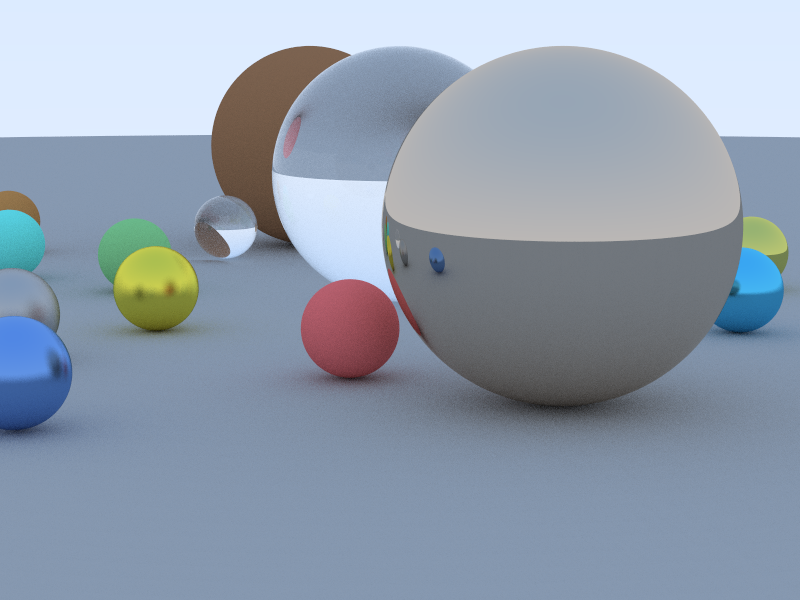

# 🌌 High-Performance CUDA Ray Tracer

A GPU-accelerated, physically-based path tracer built in C++ and CUDA. This project demonstrates the step-by-step evolution from a simple CPU-based recursive baseline to a highly-optimized, multi-threaded GPU renderer running on constant memory, utilizing per-thread random number generation (`curand`), and leveraging automated block-size benchmarking.

---

## 🎨 Visual Results

Here is a side-by-side comparison of the outputs rendered by the CPU baseline and the fully-optimized GPU path tracer. Notice the ultra-smooth anti-aliasing and precise reflections/refractions on the GPU version despite rendering at **32× higher sample density** in a fraction of the time.

| CPU Baseline (4 spp) | GPU Optimized (128 spp) |
| :---: | :---: |
|  |  |
| *Rendered in **460.3 ms** (recursive, single-thread)* | *Rendered in **24.9 ms** (iterative, GPU parallel)* |

---

## 🚀 Performance Benchmarks

The benchmark suite automatically normalizes sample counts to compare overall ray-tracing throughput (rays per second) fairly between CPU and GPU.

> **Hardware Spec:** NVIDIA GeForce RTX 5060 Laptop GPU (SM 12.0, 26 MPs, 8151 MB VRAM) vs. Intel Core Host CPU.

### 📊 Throughput Comparison

| Mode | SPP | Block Size | Render Time | Normalized Speedup | Notes |
| :--- | :---: | :---: | :---: | :---: | :--- |
| **CPU Baseline** | 4 | - | 460.3 ms | **1.0x** *(Baseline)* | Single-threaded, recursive |
| **GPU Warmup** | 1 | 8×8 | 0.9 ms | **511.0x** | JIT/Driver compilation overhead paid |
| **GPU Auto-Bench** | 32 | 32×32 | 6.9 ms | **533.0x** | Sub-optimal occupancy |
| **GPU Auto-Bench** | 32 | 16×16 | 6.4 ms | **575.0x** | Standard block size |
| **GPU Auto-Bench** | 32 | 8×8 | 6.1 ms | **603.0x** | Best block configuration |
| **GPU Full Quality** | 128 | 8×8 | **24.9 ms** | **605.0x** | **Optimal performance** |

---

## ⚡ Key CUDA Optimization Techniques

This path tracer achieves its high performance through several fundamental GPU programming paradigms:

*   **Zero-Overhead Scene Representation:** The scene geometry is stored in GPU **Constant Memory (`__constant__ CSphere d_spheres[]`)**. This allows warp-wide broadcast reads with near-zero latency, avoiding global memory cache pressure.
*   **Iterative Path Tracing:** Recursive calls are replaced with an iterative `for`-loop to bypass GPU hardware call-stack limits, preventing register spilling and device crashes.
*   **Massively Parallel RNG:** Standard C++ generators are replaced by parallelized, lock-free per-thread `curandState` structures initialized in a dedicated setup kernel.
*   **Auto-Tuning Grid Launch:** At startup, a lightweight benchmark executes to determine the fastest block size dimensions (`8x8`, `16x16`, or `32x32`) for the specific running GPU, maximizing occupancy and instruction throughput.
*   **No Virtual Dispatch:** Dynamic polymorphism (interfaces/virtual classes) is avoided in favor of high-efficiency POD structures with static enum-based switches, ideal for SIMD divergence management.

---

## 🛠️ Build and Setup (Windows)

### Prerequisites
*   **CMake** ≥ 3.18
*   **CUDA Toolkit** ≥ 11.0 (Tested on CUDA 13.2)
*   **C++17 Compiler** (MSVC 2019+ / Visual Studio 2022)

### ⚠️ Space-in-Path Windows Bug Bypass
`nvcc` has a known limitation where spaces in the directory path (e.g., `C:\Users\Suryadeep Singh\Downloads\cuda-raytracer`) cause compilation/linking errors like `c1xx: fatal error C1083`. 

To bypass this, map the project directory to a virtual drive letter (such as `Z:`) that has no spaces:
```powershell
# Map project folder to Z: drive
subst Z: "C:\Users\Suryadeep Singh\Downloads\cuda-raytracer"
```

### 1. Build using the Automated Script
Execute the provided build script from the mapped `Z:\` workspace:
```powershell
# Run from Z:\ drive
.\do_build.cmd
```

### 2. Run the Benchmarks
Once compiled, you can execute the full CPU vs GPU comparison suite:
```powershell
# Run timing benchmarks
.\benchmarks\run_benchmarks.ps1 -BuildDir Z:\build -Samples 128
```

---

## 📂 Project Structure

```
cuda-raytracer/
├── CMakeLists.txt          # CMake configure & build system
├── README.md               # Detailed project guide and analysis
├── .gitignore              # Git ignore rules
├── build_setup.cmd         # Part 1: CMake configuration script
├── build_all.cmd           # Part 2: Compiler invocation script
├── do_build.cmd            # Combined build pipeline on drive Z:
├── src/
│   ├── vec3.h              # HD-safe math vector definitions
│   ├── ray.h               # Ray struct definition
│   ├── material.h          # Material POD (Lambertian/Metal/Glass)
│   ├── sphere.h            # Sphere-ray intersection calculations
│   ├── cpu_raytracer.cpp   # C++ baseline ray tracer
│   └── cuda_raytracer.cu   # Phase 2-4 optimized CUDA ray tracer
├── benchmarks/
│   └── run_benchmarks.ps1  # Automated PowerShell benchmark script
└── renders/                # Render output directory (baseline/gpu PNGs)
```

---

## 🏷️ Tags
`cuda` · `ray-tracing` · `gpu-computing` · `graphics-programming` · `physically-based-rendering` · `cpp` · `nvcc` · `high-performance-computing`
